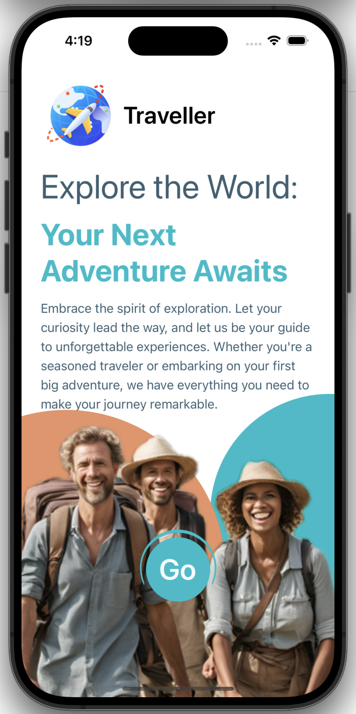
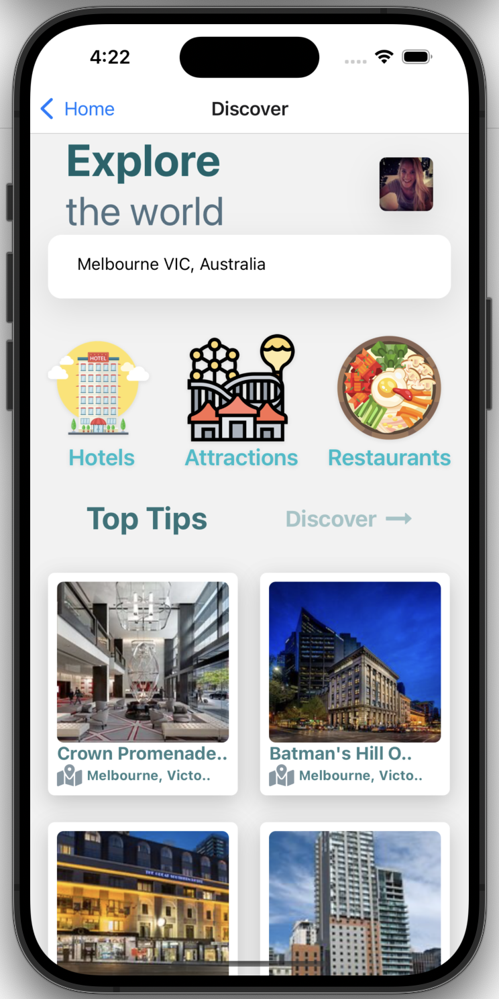
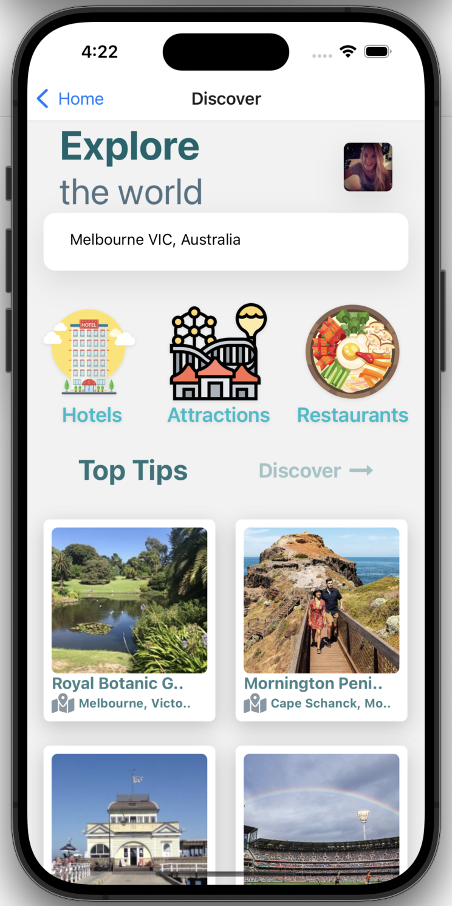
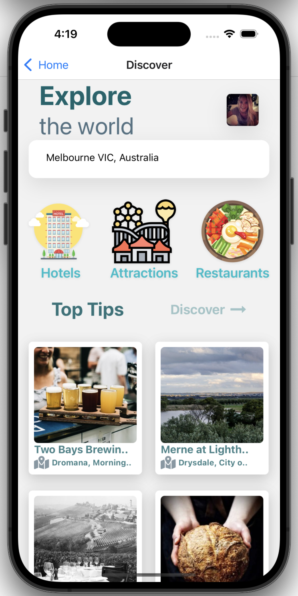
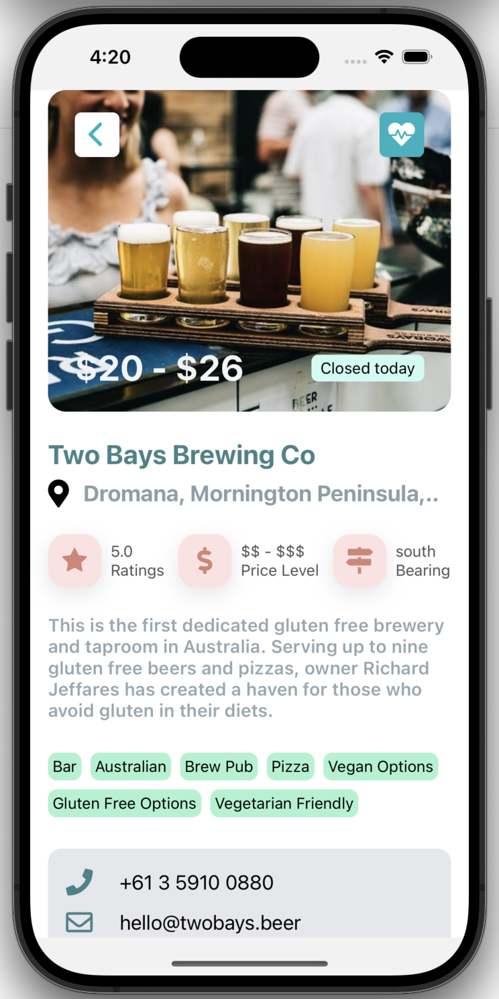
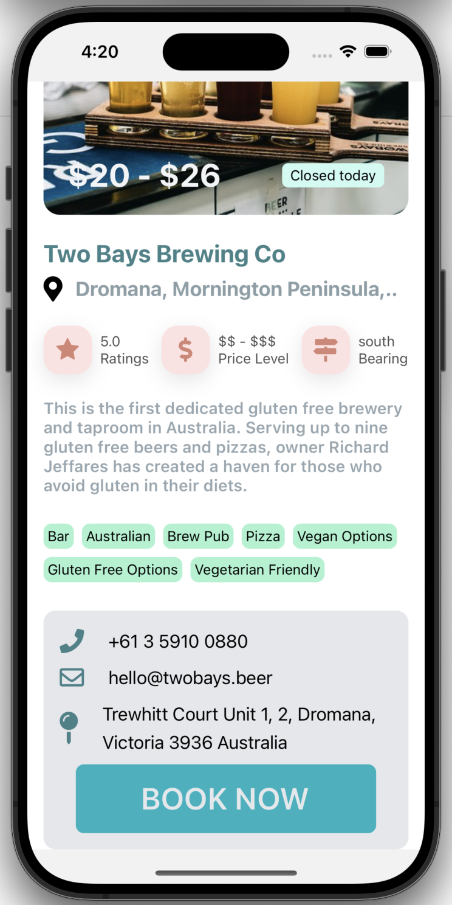

# Traveller App

## What is this?

This is a repository that houses the base code for a React Native application. The Traveller app will allow the travellers to search for information about any city and place in the world wehere they're heading to, so they can find inforation abour most iconic places, popular hotels, attractions and restaurants to explore the best of the city and town!

## Home Page

## Explore Page

Once you click on the go button this will take you to the Explore site, in this page of the application you can interact with the different features such as: find the places or location where you want to go and its different offerings this place have to explore.

&nbsp;
 
&nbsp;

## Explore Page

Once you click any of the listing places that are loaded in the screen you can find this site with all the information that could interest you such as: name of the venue, food, prices, location and bookings if required.

&nbsp;
 

## This apllication is on the palm of your hands!

You just need to scam this QR Code on your phone and it will take you to the App store where you will download the simulator application Expo Go.

Then You need to scam the next QR Code and it will take you to the Expo Go application where you can explore and interact with the Traveller application and all the features that the application offers.

### "Notes"

The application could not run very smooth due to the features of the API used for this development.

The Api is a free API that might have some delay on loading, loading only one of the three areas to explore such as: Hotels, Attraction, and restaurans or it might not even load any of this data due to the 500 limit request per month.

Also, s first version of the application it is not fully responsive to the different devices in the market.
